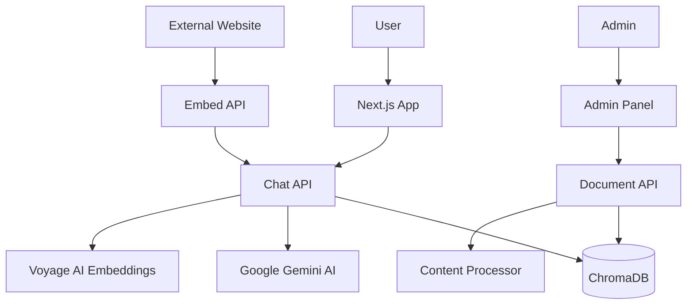

# Next.js RAG Application

A modern RAG (Retrieval Augmented Generation) application built with Next.js, using ChromaDB for vector storage, Voyage AI for embeddings, and Google's Gemini AI for text generation.

## 🌟 Features

- 🚀 **Modern Next.js 15** with App Router
- 🧠 **RAG implementation** with ChromaDB vector database
- 🤖 **Google Gemini AI** integration for intelligent responses
- 🔍 **Voyage AI embeddings** for semantic search and retrieval
- 🎨 **Beautiful UI** with shadcn/ui and Tailwind CSS
- 📱 **Responsive design** with mobile support
- 🔐 **Admin panel** for document management
- 🐳 **Docker support** for easy deployment
- 🌙 **Dark/Light theme** support
- 🔗 **Embeddable widget** for easy integration
- 📄 **Multi-format support** (PDF, HTML, JSON)

## 🚀 Quick Start

### Prerequisites

- Docker and Docker Compose
- Google AI API key ([Get one here](https://aistudio.google.com/app/apikey))
- Voyage AI API key ([Get one here](https://dash.voyageai.com/))

### Option 1: Docker Deployment (Recommended)

1. **Clone repository:**

   ```bash
   git clone https://github.com/suryaddede/next-js-rag
   cd next-js-rag
   ```

2. **Copy environment template:**

   ```bash
   cp .env.example .env
   ```

3. **Configure environment variables:**

   ```bash
   CHROMA_URL=http://chromadb:8000
   NODE_ENV=production
   NEXT_PUBLIC_APP_URL=https://your-domain.com
   CHROMA_AUTH_PASSWORD=your_secure_password_here
   GOOGLE_GENERATIVE_AI_API_KEY=your_production_api_key_here
   VOYAGE_AI_API_KEY=your_production_api_key_here
   ```

4. **Start the application:**

   ```bash
   docker compose up -d
   ```

5. **Access the application:**
   - 🏠 **Main Interface**: [http://localhost:3000](http://localhost:3000)
   - ⚙️ **Admin Panel**: [http://localhost:3000/admin](http://localhost:3000/admin)
   - 🎮 **Integration Demo**: [http://localhost:3000/demo](http://localhost:3000/demo)
   - 🗄️ **ChromaDB API**: [http://localhost:8000](http://localhost:8000)

### Option 2: Local Development

1. **Clone repository:**

   ```bash
   git clone https://github.com/suryaddede/next-js-rag
   cd next-js-rag
   ```

2. **Copy environment template:**

   ```bash
   cp .env.example .env
   ```

3. **Configure environment variables:**

   ```bash
   CHROMA_URL=http://localhost:8000
   NODE_ENV=development
   GOOGLE_GENERATIVE_AI_API_KEY=your_google_ai_api_key_here
   VOYAGE_AI_API_KEY=your_voyage_ai_api_key_here
   ```

4. **Start the application:**

   ```bash
   docker compose up -d chromadb
   npm install
   npm run dev
   ```

5. **Access the application:**
   - 🏠 **Main Interface**: [http://localhost:3000](http://localhost:3000)
   - ⚙️ **Admin Panel**: [http://localhost:3000/admin](http://localhost:3000/admin)
   - 🎮 **Integration Demo**: [http://localhost:3000/demo](http://localhost:3000/demo)
   - 🗄️ **ChromaDB API**: [http://localhost:8000](http://localhost:8000)

### Adjustable Environment Variables

| Variable          | Description                               | Default          |
| ----------------- | ----------------------------------------- | ---------------- |
| `CHUNK_SIZE`      | Maximum tokens per document chunk         | `2000`           |
| `CHUNK_OVERLAP`   | Token overlap between chunks              | `200`            |
| `EMBEDDING_MODEL` | Voyage AI embedding model to use          | `voyage-3-large` |

## 📖 How to Use

### For End Users

1. **Start Chatting**: Visit [http://localhost:3000](http://localhost:3000) and start asking questions

### For Administrators

#### Adding Documents

1. **Access Admin Panel**: Navigate to [http://localhost:3000/admin](http://localhost:3000/admin)
2. **Go to Documents**: Click on "Documents" in the sidebar
3. **Add New Document**: Click "Add Document" and provide:
   - **Title**: A descriptive name for your document
   - **URL**: Link to PDF, webpage, or JSON file
4. **Wait for Processing**: The system will automatically:
   - Download and convert the content to markdown
   - Create embeddings using Voyage AI
   - Store in ChromaDB for retrieval
5. **Embed Widget**: Use the demo page to learn how to integrate the chat widget into your website

#### Supported Content Types

| Type     | Examples                          | Description                          |
| -------- | --------------------------------- | ------------------------------------ |
| **PDF**  | Research papers, manuals, reports | Extracted using Google Gemini vision |
| **HTML** | Web pages, documentation          | Content extracted and cleaned        |
| **JSON** | API responses, structured data    | Parsed and formatted for questions   |

#### API Endpoints

| Endpoint              | Method | Description                            |
| --------------------- | ------ | -------------------------------------- |
| `/api/chat`           | POST   | Chat with RAG (retrieval + generation) |
| `/api/admin/document` | GET    | List all documents                     |
| `/api/admin/document` | POST   | Add new document                       |
| `/api/admin/document` | PUT    | Update document                        |
| `/api/admin/document` | DELETE | Remove document                        |

## 🔗 Integration with HTML

This application can be embedded as a chat widget in any HTML website.

### Quick Integration

Add this single line to your HTML page:

```html
<script src="http://localhost:3000/chat-widget.js"></script>
```

### Custom Configuration

```javascript
<script>
window.addEventListener('DOMContentLoaded', function() {
    window.RAGChatWidget.init({
        baseUrl: 'http://localhost:3000',
        position: 'bottom-right',        // bottom-right, bottom-left, top-right, top-left
        buttonColor: '#2563eb',          // Custom button color
        title: 'AI Assistant',           // Widget title
        maxWidth: '450px',               // Popup width
        maxHeight: '650px'               // Popup height
    });
});
</script>
<script src="http://localhost:3000/chat-widget.js"></script>
```

### Examples

- **[`public/integration-example.html`](public/integration-example.html)**: Complete HTML integration example
- **Demo Page**: [http://localhost:3000/demo](http://localhost:3000/demo) for live examples

For detailed integration instructions, see [`INTEGRATION.md`](INTEGRATION.md).

## 🛠️ Docker Commands

```bash
# Start all services
docker compose up -d

# Start ChromaDB only for development
docker compose up -d chromadb

# View logs
docker compose logs -f

# Rebuild and restart
docker compose down
docker compose up -d --build

# Clean up everything
docker compose down --volumes --remove-orphans
```

### Intelligent Document Chunking

The application features intelligent document chunking that automatically:

- **Token-based chunking**: Uses tiktoken to count tokens and optimize chunk sizes
- **Markdown-aware splitting**: Respects markdown headers and structure when splitting content
- **Adaptive strategy**: Uses simple chunking for small documents, header-based splitting for larger ones
- **Configurable limits**: Customize chunk size via `CHUNK_SIZE` environment variable
- **Overlap handling**: Implements smart overlap between chunks to preserve context

## 🏗️ Architecture

### System Overview



### Data Flow

1. **Document Upload**: Admin uploads document → Content processed → Embeddings created → Stored in ChromaDB
2. **User Question**: User asks question → Similar documents retrieved → Context + question sent to Gemini → Response returned
3. **Widget Integration**: External site loads widget → User chats → Same RAG flow as main interface

### Docker Services

| Service      | Port | Description         |
| ------------ | ---- | ------------------- |
| `nextjs-app` | 3000 | Next.js application |
| `chromadb`   | 8000 | Vector database     |

## 🔒 Security Considerations

- Set a secure `CHROMA_AUTH_PASSWORD` in production
- Use environment-specific API keys
- Enable HTTPS in production
- Regularly rotate API keys

## 🔍 Troubleshooting

### Common Issues

**Chat not responding:**

- Check if Google AI API key is valid
- Ensure ChromaDB is running (`docker compose ps`)
- Check logs: `docker compose logs -f`

**Documents not uploading:**

- Verify the URL is accessible
- Check if content type is supported (PDF, HTML, JSON)
- Look at admin panel logs

**Widget not showing on external site:**

- Verify the widget script URL is correct
- Check browser console for errors
- Ensure CORS is properly configured

**Database connection failed:**

- For Docker: Use `http://chromadb:8000`
- For local: Use `http://localhost:8000`
- Check if ChromaDB container is running

## 🤝 Contributing

1. Fork the repository
2. Create a feature branch: `git checkout -b feature/amazing-feature`
3. Commit changes: `git commit -m 'Add amazing feature'`
4. Push to branch: `git push origin feature/amazing-feature`
5. Open a Pull Request

## 📚 Learn More

- [Next.js Documentation](https://nextjs.org/docs)
- [ChromaDB Documentation](https://docs.trychroma.com/)
- [Google AI Studio](https://aistudio.google.com/)
- [Voyage AI Documentation](https://docs.voyageai.com/)
- [shadcn/ui Components](https://ui.shadcn.com/)

## 📄 License

This project is licensed under the MIT License - see the LICENSE file for details.
